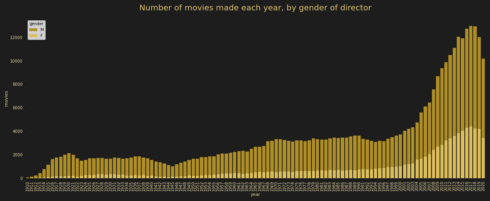

# Oscar So Predictable

### Data Science Immersive Capstone Project

## Table of contents
* [Problem Statement](###Problem-Statment)
* [Summary](###Summary)
* [Data](###Data)
* [Modeling](###Modeling)
* [Conclusions](###Conclusions)
* [Next Steps](###Next-Steps)

---------
### Problem Statement

This project examines trends in the entertainment industry and attempts to predict Academy Award favorites based on information such as: release date, plot summary, genre, production company, budget, opening WE results, and history of Oscars among a movie’s cast & crew.

--------
### Summary

Using information about movies made between 1910 and 2020, and the actors, directors, producers, and writers (amont others) involved in their making, I analyzed changes in the industry over the past 110 years, with focus on diversity. I further narrowed down to the most recent thirty years (1990-2020) and examined the data to understand dependencies between descriptive variables such as movie runtime, genres, release date, language, budget, and opening weekend results, and their combinations, and the Academy Awards that the movie either had a chance of winning or won.

Despite the wide variety of movies nominated for and awarded Oscars across the 24 categories, the final four Random Forest Classifiers predicting nominations and wins returned excellent results (see the summary table under "Modeling").

----------------
### Data

I used the following datasets provided for download from www.IMDB.com/interfaces, and enhanced the subset of data corresponding to movies made between 1990-2020, with runtime of 60-240 minutes through efforts involving web scraping and heavy data engineering. 
 
_**Note: Out of consideration for the Terms & Conditions of the scraped website, neither the downloaded data nor the final dataset used in analysis and predictions are included in the repo. Also not included is the code used for scraping of details.**_

**Table 1 : Datasets used in analysis and predictions:**
|Dataset|Description |
|---|---|
|title.basics.tsv|Information about 6.7M titles, including the type of title (movie, episode, etc.), title, release year, runtime, and genre/-s |
|title.principals.tsv|Information about the principal cast/crew for all titles, including identifier of each movie, identifier of each person, and the person's job on the movie|
|title.ratings.tsv|IMDb rating and votes information for titles|
|name.basics.tsv|Information about 10.6M individuals, including their name, birth year, death year, and profession|

---------
### Modeling

Movies made in 2020 were set aside, because the Academy nominations and awards for that year had not been announced as of the capstone project presentation date (2/23/2021). Of the remaining 175,693 movies, only 1,197 received nominations, and only 237 were Oscar winners, in any of the 24 categories. Before training the estimators, I balanced the representation of inspected classes through bootstrapping - randomly sampling from the 1,197 Oscar movies and adding those samples to the dataset.

The project started with one question: "How well can an algorithm predict whether or not a particular movie will get noticed by the Academy (nominated for an Oscar, in any category)?". I further constructed additional classifiers to answer more specific questions, as listed in Table 2:

**Table 2 : Models used in making predictions:**
|Model# |Target variable| |
|---|---|---|
|1 |0: movie will not be noticed by the Academy|1: movie will receive a nomination (and possibly win)|
|2 |0: movie will not win any of the Academy Awards|1: movie will win an Academy Award|
|3 |0: movie will not be nominated for the Best Picture award|1: movie will be a Best Picture nominee|
|4 |0: movie will not win the Best Picture award|1: movie will be the Best Picture of the Year|

Considering the imbalanced classes in the original dataset, high accuracy was easy to achieve: even a naive baseline model classifying all movies as no-nominations and no-wins scored 0.999 across all questions. The important metric that I chose to maximize for was recall (percentage of all true positives correctly predicted by the model as positives).

I initially attempted addressing all four questions using a Logistic Regression estimator in hopes of achieving an interpretable model and a "recipe for an Oscar movie". However, based on the poor recall scores of Logistic Regression with regards to all questions except for #1 above, I chose to train other estimators (Random Forest Classifiers, Support Vector Classifiers, Neural Networks, Voting Classifiers, and Stacking Classifiers) and use for predictions the one which achieved the best balance of precision and recall scores.

Without direct interpretability, I was still able to gain insight to the variables each of the Random Forest Classifiers relied on when making predictions. Interestingly, although most of the top ten features remained constant between the four models, their ranks changed from the more general "will a movie be noticed?" question to the very specific "will a movie win Best Picture":

**Table 3 : Top predictive features, ranked by question:**
|Feature|Description |#1 (nomination in any category)|#2 (award in any category)|#3 (Best Pic nomination)|#4 (Best Pic award)|   
|---|---|---|---|---|---|
|US_open_WE|box office results from the first week after the movie's theatrical release|1|1|1|3|
|budget_USD|estimated budget of a movie, in USD|2|2|2|2|
|prev_Oscars_f|number of movies with Oscar nominations or wins in which movie cast and crew were involved before movie was made|3|4|3|4|
|runtimeMinutes|duration of movie, in minutes|4|3|4|1|
|prev_Oscar_noms_nm|number of Oscar nominations previously received by the movies' cast and crew before movie was made|5|5|5|5|
|rel_USA|binary variable indicating whether the movie's theatrical release was in the USA|6|7|9|-|
|prev_Oscar_wins_nm|number of Oscars previously received by the movies' cast and crew before movie was made|7|6|6|6|
|Drama|genres with which movie was tagged include "Drama" (dummy var)|8|9|7|-|
|oscars_post_release|binary variable indicating whether the ceremony occurred after the movie's theatrical release|9|-|-|-|
|Adventure|genres with which movie was tagged include "Adventure" (dummy var)|10|-|20|20|
|Biography|genres with which movie was tagged include "Biography" (dummy var)|11|8|10|10|
|rel__nov|month of the movie's theatrical release (dummy var)|12|10|11|7|
|Comedy|genres with which movie was tagged include "Adventure" (dummy var)|14|12|12|9|
|rel_dec|month of the movie's theatrical release (dummy var)|-|12|8|17|
|Dreamworks Pictures|studio which produced the movie: Dreamworks (dummy var)|-|-|-|8|
|Miramax|studio which produced the movie: Miramax (dummy var)|-|20|-|11|
|New Regency Productions|studio which produced the movie: New Regency (dummy var)|-|-|-|12|

---------------------------
### Conclusions

1. In terms of diversity across the broader dataset spanning 1910-2020, I observed that women have historically been, and continue to be, both under-represented across most of the professions involved in movie-making, and less likely to remain active in their professions past a certain age, as evidenced by lower age averages in the chart below.

2. The Academy appears to be true to its published commitments regarding diversity - on average, the percentage of women winners has gone up from ~20% in 1990 to ~30% in 2020. Additionally, wile still lower than that of their male counterparts, the average age of women receiving Oscars is also on an upwards trend and is growing faster than average age of the men who won Oscars in the last 30 years.

3. "Academy Sweethearts" (artists and performers to whom the Academy has been more generous than others) are by no means guaranteed to keep winning.

4. "Oscar-dense" movies (movies whose cast and crew includes many previous Academy Award winners and nominees) are also not guaranteed any favors.

5. New-comers (artists who have not previously been noticed by the Academy) are nearly as likely to receive an Award as the Academy veterans.

6. The five most important features: opening weekend results, budget, history of previous Oscar movies among the cast and crew, and runtime, remain unchanged across the four models. Notably, the movie duration (runtime) pays a much higher role in predicting Best Picure winners than any of the other three classes.

-----------------------
### Next Steps

Due to the limitations of this final project, I have not been able to explore the following areas which I intend to address through further exploration:

- Other aspects of diversity in the industry and the Oscars
- Analysis of results by category (e.g. Best Cinematography)
- Bayes: probability of nomination given Golden Globe nomination award given nomination, etc.
- Review and study clusters for archetypes of “Oscar movies”

-----------------------
